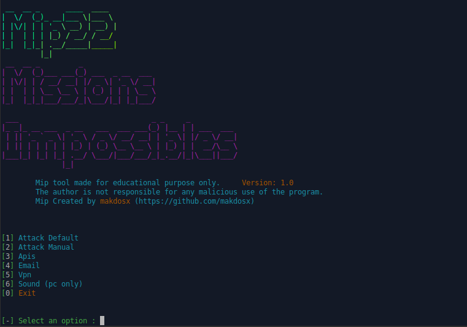
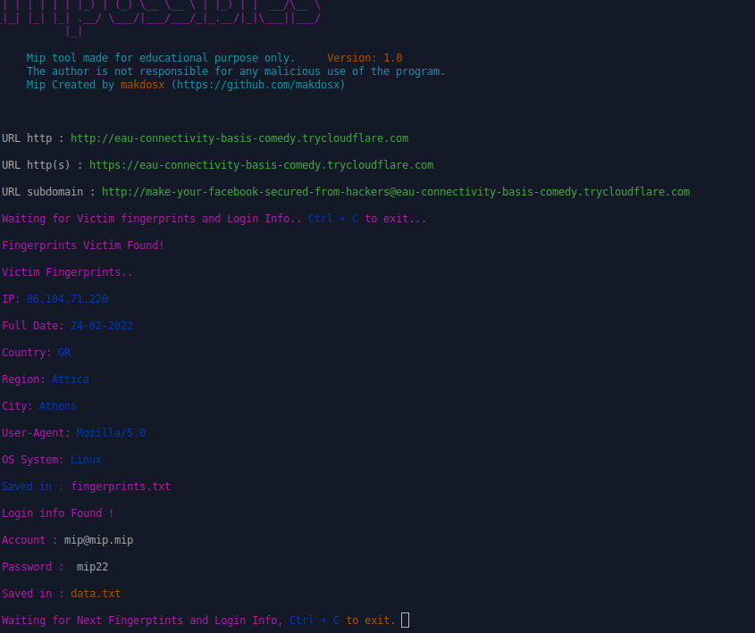

# mip22
 <h1 align="center"> mip22 </h1>
 
 <h2 align="center"> mip22 is a advanced phishing tool </h2> 

<p align="center">
  </br>
</p>


```diff
- The program is made for educational purposes only for to see how the phishing method works.
- Any unnecessary use of the program is prohibited and the manufacturer has no responsibility for any illegal use by anyone.
- Use the tool at your own risk and avoid any sloppy actions.
```
<h3 align="center">
Feautures and Properties.
</h3>

<p align="center">
Mip22 is a modern and advanced cyber security program for computers with Gnu / Linux operating system and mobile phones and tablets with android operating system, for educational purposes.
</p>

 
<br/> <br/> <br/> 
 
<p>
 
Details
 
1) Automatic method
2) Manual Method
3) Tunnels Setup 
4) Email Services
5) Vpn instructions
6) Sound Efects (only for pc)
 
</p>

<br/> <br/> <br/> 

<p>
 
1) Automatic method

Easy to use via terminal.
Automatic cloned services.
It has 69 ready cloned electronic services, including social networks, e-mails, cloud, multumedia etc etc. 
 




</p>

<br/> <br/> <br/> 

 
