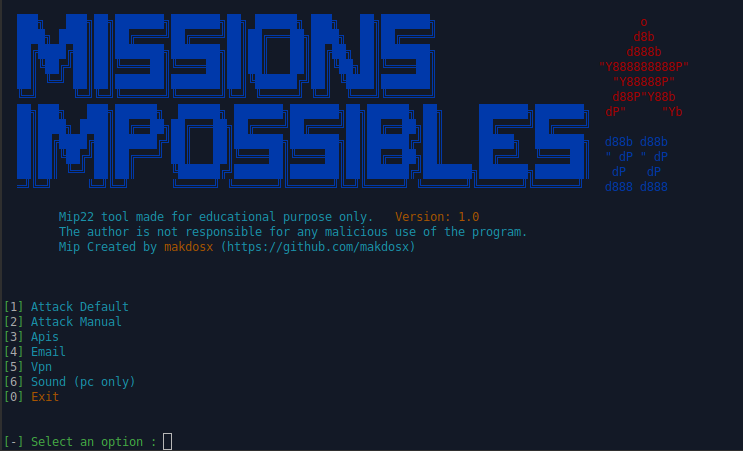
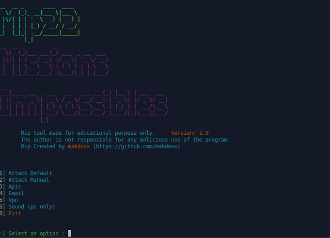
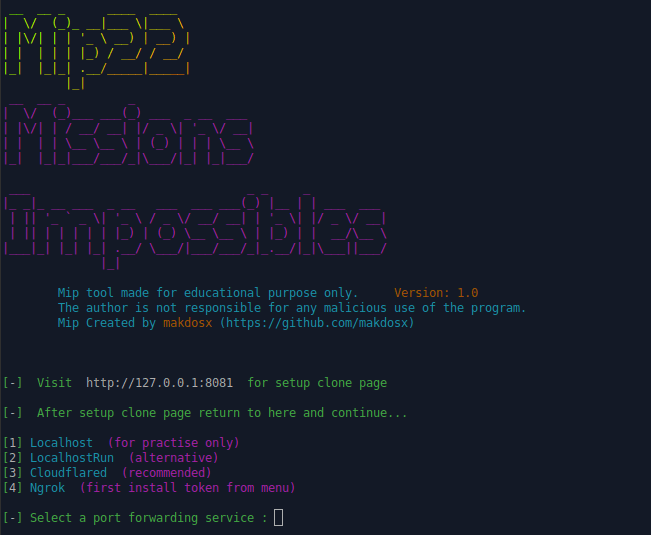

# mip22
 <h1 align="center"> mip22 v2.0 </h1>
 
 <h2 align="center"> mip22 is a advanced phishing tool </h2> 

<p align="center">
  </br>
</p>


<h3>

The program is made for educational purposes only for to see how the phishing method works.
Any unnecessary use of the program is prohibited and the manufacturer has no responsibility for any illegal use by anyone.
Use the tool at your own risk and avoid any sloppy actions.

 </h3>


<h4> Installation Instractuions </h4>


<p>

Installation on Gnu / Linux OS. </br>

On terminal </br>

```diff
 sudo su 
```

```diff
git clone https://github.com/makdosx/mip22.git
```
```diff
chmod -R 777 mip22 
```

```diff
cd mip22
```

```diff
bash mip22.sh
```

</br> </br>


Installation on Android OS. </br>

On Termux </br>

```diff
git clone https://github.com/makdosx/mip22.git
```

```diff
chmod -R 777 mip22 
```

```diff
cd mip22 
```

```diff
bash mip22.sh
```

</br> </br>

</p>


<h3 align="center">
Feautures and Properties.
</h3>

<p align="center">
Mip22 is a modern and advanced cyber security program for computers with Gnu / Linux operating system and mobile phones and tablets with android operating system, for educational purposes.
</p>

 
 <br/> <br/> <br/>

 
<p>
 
Details
 
1) Automatic method
2) Manual Method
3) Tunnels Setup 
4) Email Services
5) Vpn instructions
6) Sound Efects (only for pc)
 
</p>

<br/> <br/> <br/> 

<p>
 
1) Automatic method

Easy to use via terminal. </br>
Automatic cloned services. </br>
It has 69 ready cloned electronic services, including social networks, e-mails, cloud, multumedia etc etc. </br>
 

</p>

<br/> <br/> <br/> 

<p>
 
2) Manual Method 
 
Cloning services manually by cloning the service you want.
Easy to use through browser service.
 


<p> 
 
<br/> <br/> <br/>  


<p>


3) Tunnels Setup </br>
   It has 3 tunnels to promote these services from the local server to the internet. </br>
   It has ready api for the installation of some tunnels.  </br>


4) Email Services </br>
   It has 3 well-known external email services found on the internet where you can visit to send an email. </br>


5) Vpn instructions </br>
   It has various instructions fron vpn on Android OS. </br>


6) Sound Efects (only for pc) </br> 
   It has various effects such as music in the background. </br> 
 
 
7) Notifications
    
    

   For instant data access during an attack, when someone logs in, an alarm sounds so users do not have to look at      the terminal all the time to see the data. 
   (At this time Computer compatible only)

</p> 
